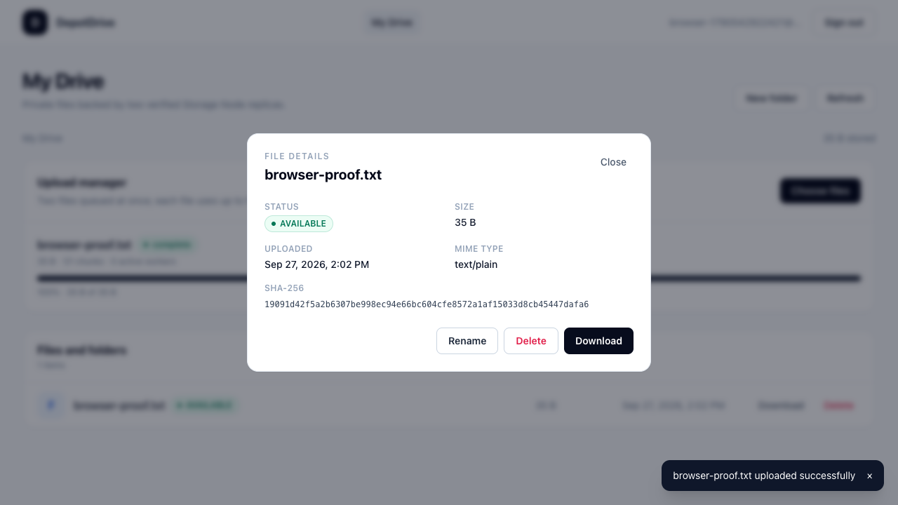
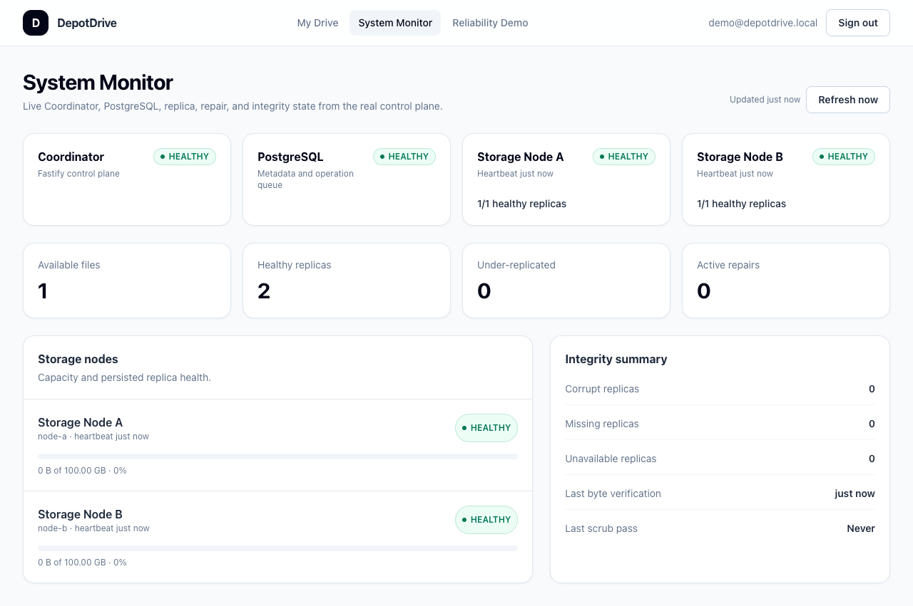
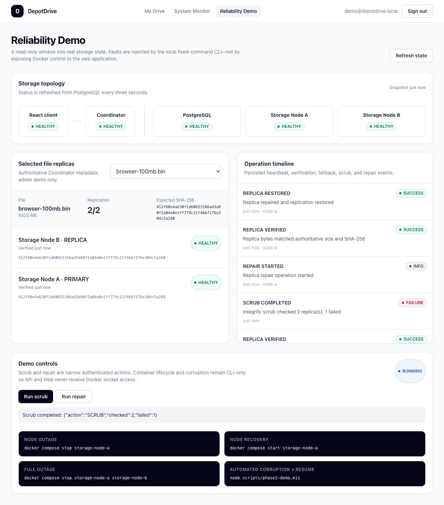

# DepotDrive V1.0 — Self-Healing Distributed Storage

English | [简体中文](./README.zh-CN.md)

DepotDrive is a Dropbox-like project built with React, TypeScript, Fastify, PostgreSQL, Prisma, and Docker Compose. It demonstrates two independent Storage Node processes/volumes, byte-level integrity verification, durable replica repair, and resumable 8 MiB chunk uploads.

The finished React product includes authentication, a responsive Drive, a measured multi-file upload manager, file details, an administrator System Monitor, and a reliability timeline backed by real PostgreSQL events.

## Product UI







## Proven behavior

- A file becomes `AVAILABLE` only after two independent nodes store verified complete replicas.
- Downloads stage and streaming-hash a candidate before sending any bytes to the client.
- Missing, same-size corrupted, unavailable, and healthy replicas have distinct persisted states.
- A bad primary falls back to a verified replica and enqueues durable automatic repair.
- Scrubbing periodically verifies oldest replicas and triggers repair.
- `REPAIR_REPLICA` operations survive API restart and are idempotent.
- Browser reload/network interruption/API restart preserve upload progress; reselecting the same file sends only missing chunks.
- Real PostgreSQL, two real Storage Nodes, container outage, corruption, repair, duplicate resume, and 100 MiB restart-resume are covered by the default test suite.

## Architecture

```text
React Web :5173
  |
Fastify API / Coordinator :3000 ─── PostgreSQL :5432
  |                                  durable metadata + operations
  ├── authenticated HTTP ── Storage Node A :4001 ── storage_a_data
  └── authenticated HTTP ── Storage Node B :4002 ── storage_b_data

API session/verification staging ── api_uploads_data
```

The API never mounts Storage Node volumes. This is a single-host, single-Coordinator deployment; it does not claim multi-machine or multi-region fault tolerance.

## Tech stack

- React 19, TypeScript, Vite, React Query
- Node.js and Fastify
- PostgreSQL 16 and Prisma
- Two Fastify Storage Node services with filesystem-backed named volumes
- Docker Compose, Vitest and Playwright

## Start locally

Requirements: Docker with Compose; Node.js 20+ and npm for host tests/development.

```bash
git clone <repository-url>
cd DepotDrive
cp .env.example .env
# Run `openssl rand -hex 32` twice, then paste the independent values
# after JWT_SECRET= and STORAGE_INTERNAL_TOKEN= in .env.
docker compose up -d --build --wait
docker compose ps
```

Open `http://localhost:5173`. The API is `http://localhost:3000`. The API container automatically runs committed Prisma migrations.

For the opt-in local interactive demo, use the override below. Production Compose does not expose demo mutations or create a demo administrator.

```bash
docker compose -f docker-compose.yml -f docker-compose.demo.yml up -d --build --wait
# Local defaults: demo@depotdrive.local / DepotDemo123!
# Override DEMO_ADMIN_EMAIL and DEMO_ADMIN_PASSWORD as needed.
```

```bash
docker compose stop           # retain data
docker compose down --volumes # delete local data
```

## Host development

```bash
cp .env.example .env
# Set JWT_SECRET and STORAGE_INTERNAL_TOKEN to independent 32+ character random values.
npm install
npm run prisma:generate
docker compose up -d postgres storage-node-a storage-node-b --wait
npm run prisma:deploy -w @depot-drive/api
npm run dev
```

`.env.example` uses node host ports 4001/4002. Full Compose overrides endpoints with service DNS names.

## Quality gates

```bash
npm run typecheck
npm run build
npm test
```

`npm test` builds disposable Storage Nodes, starts a dedicated PostgreSQL database, applies all migrations, runs unit plus real integration/fault tests, and removes the test environment. Unavailable infrastructure fails explicitly; tests do not silently skip.

Latest verified result: **55 passed, 0 failed, 0 skipped** (15 API unit, 19 Web, 4 Storage Node, 15 PostgreSQL/Storage integration/fault, and 2 full-Compose Playwright browser tests).

The browser suite uploads and resumes a real 100 MiB file across refresh and API restart, proves it sends exactly the server-reported missing chunks, exercises node outage/fallback and complete-outage 503 semantics, injects byte corruption, and observes persisted corrupt/repair events. Monitoring is never mocked in this E2E path.

## Reproduce Phase 2

With full Compose running:

```bash
node scripts/phase2-demo.mjs
```

The script uploads 100 MiB, verifies two container-volume copies, flips one byte in Node A, proves `CORRUPT` detection and correct fallback, waits for automatic repair, verifies both hashes, interrupts a second 100 MiB upload at 7/13 chunks, restarts the API, sends only chunks 7–12, and verifies the final SHA-256.

The deterministic demo SHA-256 is `412f60e4a630f1d60653186ad3d80f2a04e0e1ff779c21f46bf176e304c5a260`.

## Design decisions

- PostgreSQL is both authoritative metadata and the durable operation queue; V1 does not need Redis or a message broker.
- Replica writes are idempotent and reconciliation-friendly because PostgreSQL and remote filesystems cannot share an ACID transaction.
- Downloads are fully staged and hashed before response bytes begin. This favors demonstrable correctness over low time-to-first-byte.
- Container/process/volume isolation makes node failures independently testable on one laptop without claiming physical-machine isolation.

## Storage Node API

Every route requires `Authorization: Bearer <STORAGE_INTERNAL_TOKEN>`.

| Method | Path | Purpose |
|---|---|---|
| `GET` | `/health` | Liveness and capacity |
| `PUT` | `/objects/:objectKey` | Atomic streaming write; expected size/SHA-256 required |
| `HEAD` | `/objects/:objectKey` | Persistent size/SHA-256 metadata |
| `GET` | `/objects/:objectKey` | Object stream |
| `DELETE` | `/objects/:objectKey` | Idempotent object deletion |

Repair alone sends `X-Allow-Replace: true`. Fault endpoints exist only in the test Compose environment.

## Important configuration

| Variable | Default | Purpose |
|---|---:|---|
| `CHUNK_SIZE_BYTES` | 8388608 | 8 MiB chunks |
| `UPLOAD_SESSION_TTL_SECONDS` | 86400 | Abandoned session lifetime |
| `MAX_ACTIVE_UPLOAD_SESSIONS_PER_USER` | 20 | Per-user active session cap |
| `HEARTBEAT_INTERVAL_MS` | 10000 | Node health probe interval |
| `STORAGE_FAILURE_TIMEOUT_MS` | 30000 | Heartbeat freshness |
| `REPAIR_INTERVAL_MS` | 30000 | Repair worker interval |
| `REPAIR_UNAVAILABLE_GRACE_MS` | 300000 | Delay before outage replacement |
| `SCRUB_INTERVAL_MS` | 21600000 | Six-hour scrub interval |
| `SCRUB_BATCH_SIZE` | 10 | Replicas per scrub pass |

## Limitations

- Reads use verified Coordinator staging, increasing time-to-first-byte and temporary disk use.
- A browser refresh requires selecting the file again; only session metadata is persisted.
- With exactly two nodes, a down node cannot be replaced until it returns; one healthy copy remains degraded.
- One API Coordinator is supported. PostgreSQL operation claiming prevents obvious races but is not consensus.
- All services still share one physical Docker host. No multi-region, S3, Kubernetes, Redis, Kafka, sharing, preview, search, or trash is claimed.
- Demo node lifecycle and corruption are CLI-only by design. The API/Web never receive the Docker socket; web demo mutations are limited to authenticated same-origin scrub/repair.

## Documentation

- [Phase 2 implementation](./docs/v1/PHASE2_IMPLEMENTATION.md)
- [Self-healing design](./docs/v1/SELF_HEALING_DESIGN.md)
- [Resumable upload design](./docs/v1/RESUMABLE_UPLOAD_DESIGN.md)
- [Phase 2 test results](./docs/v1/PHASE2_TEST_RESULTS.md)
- [Phase 2 demo](./docs/v1/PHASE2_DEMO.md)
- [Updated architecture](./docs/v1/UPDATED_ARCHITECTURE.md)
- [Frontend implementation](./docs/portfolio/FRONTEND_IMPLEMENTATION.md)
- [Final test results](./docs/portfolio/FRONTEND_TEST_RESULTS.md)
- [Interactive demo guide](./docs/portfolio/INTERACTIVE_DEMO.md)
- [Resume claim verification](./docs/portfolio/RESUME_VERIFICATION.md)
- [75-second video script](./docs/portfolio/DEMO_VIDEO_SCRIPT.md)
- [Final Git audit](./docs/release/GIT_AUDIT.md)
- [Security audit](./docs/release/SECURITY_AUDIT.md)
- [Manual acceptance checklist](./docs/release/MANUAL_ACCEPTANCE.md)
- [Final release audit](./docs/release/FINAL_RELEASE_AUDIT.md)
- [Original audit](./docs/audit/AUDIT_REPORT.md)
